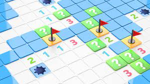

# Minesweeper Game



Welcome to the Minesweeper game! This Python-based Minesweeper game allows you to play the classic Minesweeper game where the goal is to uncover all safe cells on a grid without hitting any mines. The game includes an AI bot that can assist you in making safe moves and uncovering mines intelligently.

## Table of Contents
- [Game Introduction](#game-introduction)
- [Installation](#installation)
- [How to Play](#how-to-play)
- [Game Features](#game-features)
- [AI Bot](#ai-bot)
- [Contributing](#contributing)
- [License](#license)

## Game Introduction

Minesweeper is a single-player puzzle game where you are presented with a grid of cells, some of which contain hidden mines. The objective is to uncover all safe cells without detonating any mines. Cells that do not contain mines display a number indicating how many neighboring cells contain mines. The game is won when all safe cells are uncovered, and it's lost if you uncover a mine.

## Installation

To play the game, follow these installation steps:

1. Clone the repository to your local machine:

   ```bash
   git clone https://github.com/your-username/minesweeper-game.git
   ```

2. Navigate to the project directory:

   ```bash
   cd minesweeper-game
   ```

3. Run the game using the following command:

   ```bash
   python minesweeper.py
   ```

## How to Play

1. Upon starting the game, you will see an initial Minesweeper grid.

2. Click on a cell to uncover it. If it contains a mine, the game is lost.

3. The numbers displayed on uncovered cells indicate how many neighboring cells contain mines.

4. Use this information to deduce which cells are safe to uncover.

5. Right-click on a cell to flag it as a mine if you suspect it contains one. This helps you keep track of potential mine locations.

6. Continue uncovering safe cells and flagging mines until you uncover all safe cells or hit a mine.

7. If you uncover all safe cells without hitting a mine, you win the game.

## Game Features

- Classic Minesweeper gameplay: Uncover cells and flag potential mines.
- Intelligent AI Bot: The AI bot can assist you in making safe moves and uncovering mines strategically.
- Game status: The game provides feedback on whether you've won or lost.
- Flagging mines: Right-click on a cell to flag it as a mine.

## AI Bot

The Minesweeper AI bot is designed to assist you in making safe moves and uncovering mines intelligently. It uses a logical reasoning approach based on the knowledge of the game board. The AI bot can mark cells as safe or as mines based on the information available, helping you avoid mines and progress in the game.

## Contributing

If you'd like to contribute to this project, please feel free to submit issues or pull requests. Your contributions are welcome!

## License

This project is licensed under the MIT License. See the [LICENSE](LICENSE) file for details.

Enjoy playing Minesweeper and challenging yourself to uncover all the safe cells while avoiding the mines!
